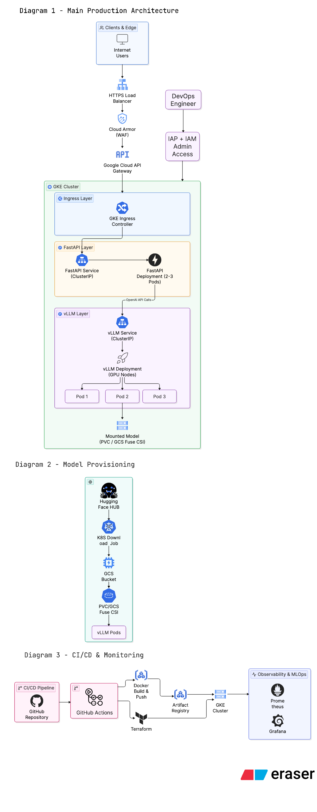
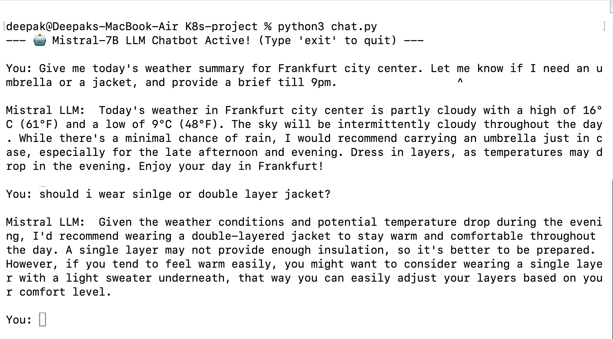
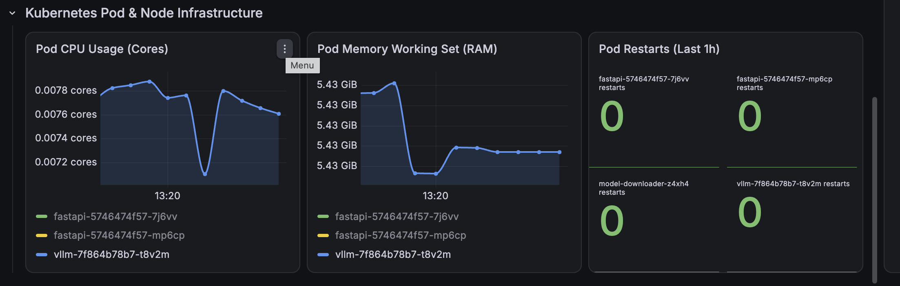
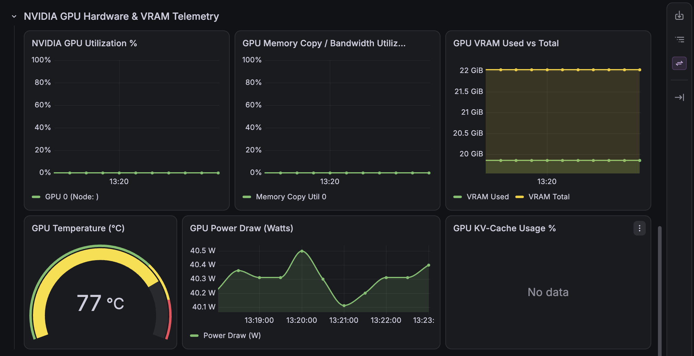
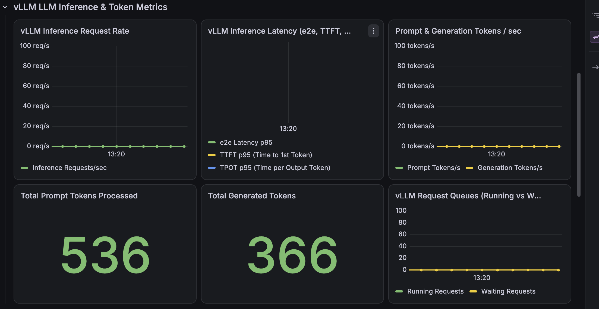

# Deployment of  Mistral-7B LLM on Google Kubernetes Engine 

[](https://github.com)
[](https://cloud.google.com/kubernetes-engine)
[](https://github.com/vllm-project/vllm)
[](https://fastapi.tiangolo.com)
[](https://www.terraform.io)
[](https://cloud.google.com)

An enterprise ready, highly available, and secure infrastructure deployment for serving **Mistral-7B-Instruct-v0.3** large language models at scale. Built with **Terraform**, **GKE (NVIDIA GPU Node Pools)**, **vLLM (PagedAttention)**, **FastAPI Gateway (OpenAI-compatible)**, **GCS FUSE CSI**, **Cloud Armor**, **Google-managed HTTPS Load Balancing**, **Prometheus/Grafana observability**, and automated **GitHub Actions CI/CD with Workload Identity Federation**.

---

## 1. Architecture Overview

The system is designed with a defense in depth, decoupled microservices pattern separating the edge security layer, API gateway tier, and GPU inference backend.




---

## 2. Key Features

- **High-Throughput LLM Serving**: Powered by **vLLM** leveraging PagedAttention, continuous batching, and dynamic KV cache allocation for low latency token generation.
- **OpenAI-Compatible FastAPI Gateway**: Async, high-concurrency API exposing standard `/v1/chat/completions` (with streaming Server Sent Events), health endpoints (`/health`, `/ready`), and auto generated OpenAPI/Swagger documentation (`/docs`).
- **GCS FUSE CSI Storage Integration**: Direct POSIX compliant mounting of model weights from Google Cloud Storage into GPU pods, eliminating slow init container downloads and multi gigabyte disk duplication.
- **Enterprise Edge Security**: Google Cloud Armor WAF integration for DDoS mitigation, rate limiting, and geo filtering, combined with Google managed SSL certificates and optional Identity Aware Proxy (IAP).
- **GPU-Aware Scheduling & Resilience**: Dedicated GKE GPU node pools configured with taints, tolerations, node affinity, `nvidia.com/gpu` resource limits, and PodDisruptionBudgets (PDB) to prevent cold restarts.
- **End-to-End Infrastructure as Code (IaC)**: Fully parameterized Terraform modules managing VPC networking, Private GKE clusters, GPU node pools, IAM Workload Identity, Artifact Registry, and Cloud Storage buckets.
- **Zero-Key CI/CD Pipelines**: GitHub Actions leveraging GCP Workload Identity Federation (WIF) via OIDC for keyless authentication, automated container builds, vulnerability scans, and canary/rolling deployments.
- **Full-Stack Observability**: Native Prometheus and Grafana integration monitoring NVIDIA DCGM metrics (VRAM, GPU SM utilization, temperature), vLLM inference performance (time to first token, tokens/sec, queue depth), and gateway HTTP metrics.

---

## 3. Technology Stack

| Layer | Technologies & Tools |
| :--- | :--- |
| **Compute & Orchestration** | Google Kubernetes Engine (GKE v1.28+), Kubernetes Deployments, Services, ConfigMaps, Secrets, PDB |
| **GPU Acceleration** | NVIDIA L4 (24GB) / NVIDIA A100 (40GB), NVIDIA Container Toolkit, DCGM Exporter |
| **LLM Inference Engine** | vLLM (`mistralai/Mistral-7B-Instruct-v0.3`), PagedAttention, Ray-compatible runtime |
| **API Gateway** | Python 3.11, FastAPI, Uvicorn, Pydantic v2, HTTPX (Async), Prometheus Client |
| **Model Storage** | Google Cloud Storage (GCS), GCS FUSE CSI Driver (`gcsfuse`) |
| **Infrastructure as Code** | Terraform v1.5+, Google Cloud Provider, Helm Provider, Kubernetes Provider |
| **Edge Networking & Security**| Cloud DNS, Google Cloud Armor, External HTTPS Ingress, ManagedCertificate, BackendConfig, FrontendConfig |
| **Identity & Access** | GCP IAM, Workload Identity Federation (WIF), GKE Service Accounts (KSA-to-GSA) |
| **CI/CD Automation** | GitHub Actions, Google Artifact Registry, Docker Multi-stage Builds, Hadolint, Pytest |
| **Monitoring & Logging** | Prometheus Operator, Grafana, NVIDIA DCGM Exporter, Google Cloud Logging/Monitoring |


## 4. Model Provisioning Flow

Instead of baking a ~15GB model into a container image or downloading weights on every pod restart, model management is centralized in Google Cloud Storage:

```
┌─────────────────────────┐
│ Hugging Face Hub        │
│ (Mistral-7B Weights)    │
└────────────┬────────────┘
             │
             │ 1. One-time Sync via K8s Job / gsutil
             ▼
┌─────────────────────────┐
│ Google Cloud Storage    │  Bucket: gs://<YOUR_PROJECT_ID>-mistral-models
│ (Model Bucket)          │  Path:   /mistral-7b-instruct-v0.3/
└────────────┬────────────┘
             │
             │ 2. Mounted into Pod filesystem at runtime
             ▼
┌─────────────────────────┐
│ GCS FUSE CSI Driver     │  Annotation: gke-gcsfuse/volumes
│ (In-Kernel Virtual FS)  │  MountPath:  /mnt/models
└────────────┬────────────┘
             │
             │ 3. Instant zero-copy memory mapping
             ▼
┌─────────────────────────┐
│ vLLM Inference Engine   │  vllm serve /mnt/models/mistral-7b-instruct-v0.3
│ (NVIDIA GPU Pod)        │  
└─────────────────────────┘
```

1. **One-Time Ingestion**: A Kubernetes Provisioning Job (`k8s/model-provisioning/04-job.yaml`) authenticates to Hugging Face using a secret token and synchronizes model weights directly to GCS.
2. **GCS FUSE Mounting**: GKE's native `gcsfuse` CSI driver mounts the model bucket directly as a POSIX filesystem within the vLLM pod.
3. **Sub-Minute Pod Startup**: vLLM reads directly from the stream backed mount, drastically reducing pod initialization latency.

---

## 5. Kubernetes/GKE Deployment Architecture

The Kubernetes layer is decoupled into specialized workloads:

| Component | Manifest Path | Scaling & Sizing | Node Assignment |
| :--- | :--- | :--- | :--- |
| **Namespace & RBAC** | `k8s/fastapi/00-namespace.yaml` | Scoped namespace `mistral-serving` | N/A |
| **FastAPI Gateway** | `k8s/fastapi/04-deployment.yaml` | Replicas: 3+, HPA on CPU/RPS, PDB (minAvailable: 1) | `node-pool-cpu` (e2-standard-4) |
| **vLLM GPU Server** | `k8s/vllm/01-deployment.yaml` | Replicas: 1-2, PDB (maxUnavailable: 0) | `node-pool-gpu` (`nvidia.com/gpu: 1`, `g2-standard-8` / `a2-highgpu-1g`) |
| **Model Ingestion** | `k8s/model-provisioning/04-job.yaml` | One shot Batch Job with Workload Identity | `node-pool-cpu` |
| **Cloud Networking** | `k8s/networking/03-ingress.yaml` | Global HTTPS Ingress + ManagedCert + BackendConfig | GKE L7 Ingress Controller |
| **DCGM Exporter** | `k8s/monitoring/01-dcgm-exporter.yaml` | DaemonSet on GPU nodes | `node-pool-gpu` (tolerates GPU taints) |

---

## 6. Security & Identity

- **Workload Identity (KSA ↔ GSA)**: Pods access GCP APIs (GCS, Artifact Registry) via IAM bindings without storing static JSON service account keys in the cluster.
- **Cloud Armor Web Application Firewall**:
  - Layer 7 rate limiting (e.g., max 100 req/min per client IP).
  - Geographic blocking and CIDR IP allowlisting.
  - OWASP Top 10 mitigation rules (SQLi, XSS, RCE protection).
- **Least Privilege Principle**:
  - GKE nodes run with minimal default scopes; granular permissions are granted to workload specific Google Service Accounts.
  - Containers run as non-root with read-only root filesystems where applicable.
- **Encrypted In-Transit & At-Rest**:
  - TLS 1.3 termination at the Google Global Load Balancer with automated certificate lifecycle management via `ManagedCertificate`.
  - Node-to-node internal network encryption with Google VPC native alias IP routing.
  - GCS Customer Managed Encryption Keys (CMEK) or Google managed encryption for model storage.

---

## 7. CI/CD Pipeline

The project employs a fully automated GitHub Actions pipeline located in `.github/workflows/`:

```
┌────────────────────────────────────────────────────────┐
│             PR / Branch Push Trigger                   │
└──────────────────────────┬─────────────────────────────┘
                           │
             ┌─────────────┴─────────────┐
             ▼                           ▼
  ┌──────────────────────┐    ┌──────────────────────┐
  │   CI: Code Quality   │    │  CI: Docker Linting  │
  │ • Black / Flake8     │    │ • Hadolint           │
  │ • Pytest Unit Tests  │    │ • Security Scan      │
  └──────────┬───────────┘    └──────────┬───────────┘
             └─────────────┬─────────────┘
                           │ Merge to Main
                           ▼
  ┌──────────────────────────────────────────────────────┐
  │  CD: Keyless Authentication (GCP WIF via OIDC)       │
  └────────────────────────┬─────────────────────────────┘
                           ▼
  ┌──────────────────────────────────────────────────────┐
  │  Docker Multi-Stage Build & Push to Artifact Registry│
  └────────────────────────┬─────────────────────────────┘
                           ▼
  ┌──────────────────────────────────────────────────────┐
  │  Automated GKE Deployment & Rolling Update Rollout   │
  │  • kubectl set image / kustomize build               │
  │  • kubectl rollout status verification               │
  └──────────────────────────────────────────────────────┘
```

1. **Continuous Integration (`ci.yaml`)**:
   - Python code quality checks with `black` and `flake8`.
   - Unit and integration tests with `pytest` using mocked vLLM backend fixtures.
   - Container linting with `hadolint`.
2. **Continuous Delivery (`cd.yaml`)**:
   - Authenticates to GCP using Workload Identity Federation (no long lived service account keys stored in GitHub Secrets).
   - Builds optimized, multi stage production Docker image (`Dockerfile`).
   - Pushes images tagged with commit SHA and `latest` to Google Artifact Registry.
   - Deploys updated manifests to GKE with rollout status checks and automatic rollback on failure.

---

## 8. Monitoring & Observability

Observability is implemented using Prometheus Operator and Grafana:

| Layer | Metrics Collected | Exporter / Source |
| :--- | :--- | :--- |
| **GPU Hardware** | GPU Utilization (%), VRAM Usage (MB), Temperature (°C), Power Draw (W), PCIe Throughput | NVIDIA DCGM Exporter (`DCGM_FI_DEV_GPU_UTIL`, `DCGM_FI_DEV_FB_USED`) |
| **vLLM Engine** | Time to First Token (TTFT), Inter-token Latency, Prompt/Generation Token Count, Running/Waiting Requests, KV Cache Usage (%) | vLLM Native Prometheus Endpoint (`:8000/metrics`) |
| **FastAPI Gateway** | Request Rate (RPS), Error Rates (4xx/5xx), Request Latency (p50/p95/p99), Active Connections | FastAPI Prometheus Middleware (`/metrics`) |
| **GKE Infrastructure** | Node CPU/Memory saturation, Pod restart counts, Network I/O, PVC utilization | Kubernetes `kube-state-metrics` & `node-exporter` |

Pre-configured Grafana dashboards are provided in `k8s/monitoring/04-grafana-dashboard-configmap.yaml`.

---

## 9. How to Deploy / Run

### Prerequisites
- [Google Cloud SDK (`gcloud`)](https://cloud.google.com/sdk/docs/install)
- [Terraform (>= 1.5.0)](https://developer.hashicorp.com/terraform/downloads)
- [kubectl](https://kubernetes.io/docs/tasks/tools/)
- [Docker](https://docs.docker.com/get-docker/) & Docker Compose

---

### Step 1: Infrastructure Provisioning (Terraform)

```bash
# 1. Authenticate with Google Cloud
gcloud auth login
gcloud auth application-default login
gcloud config set project <YOUR_GCP_PROJECT_ID>

# 2. Navigate to terraform directory
cd terraform

# 3. Configure variables
cp terraform.tfvars.example terraform.tfvars
# Edit terraform.tfvars with your project_id, region, and node pool specs

# 4. Initialize and apply infrastructure
terraform init
terraform plan 
terraform apply

# 5. Connect kubectl to the new GKE cluster
gcloud container clusters get-credentials <CLUSTER_NAME> \
  --region <REGION> \
  --project <YOUR_GCP_PROJECT_ID>
```

---

### Step 2: Model Provisioning to GCS

```bash
# 1. Create the Hugging Face token secret
kubectl create secret generic hf-token-secret \
  --from-literal=token=<YOUR_HUGGINGFACE_TOKEN> \
  -n mistral-serving

# 2. Run the model sync job to populate the GCS bucket
kubectl apply -f k8s/model-provisioning/00-serviceaccount.yaml
kubectl apply -f k8s/model-provisioning/04-job.yaml

# 3. Monitor sync progress
kubectl logs -f job/mistral-model-sync -n mistral-serving
```

---

### Step 3: Deploy Workloads to GKE

```bash
# 1. Deploy vLLM GPU inference service
kubectl apply -f k8s/vllm/

# Verify vLLM pod is running and model weights are mounted
kubectl get pods -n mistral-serving -l app=vllm
kubectl logs -f -n mistral-serving -l app=vllm

# 2. Deploy FastAPI Gateway
kubectl apply -f k8s/fastapi/

# 3. Deploy Ingress, Cloud Armor, and SSL configuration
kubectl apply -f k8s/networking/

# 4. Deploy Monitoring Stack (Prometheus & Grafana)
kubectl apply -f k8s/monitoring/
```

---

### Step 4: Local Development Flow (Docker Compose)

For offline testing and UI development without GPU hardware:

```bash
# 1. Copy local environment file
cp .env.example .env

# 2. Launch FastAPI gateway container
docker compose up --build

# 3. Access Swagger API documentation
open http://localhost:8000/docs
```

---

## 10. How to Test the Mistral API & Chatbot

### Interactive CLI Chatbot Client (`chat.py`)
Run the included terminal client:

```bash
# Test against local container
python chat.py --base-url http://localhost:8000

# Test against production GKE ingress
python chat.py --base-url https://<YOUR_INGRESS_IP_OR_DOMAIN>
```


## 11. Project Folder Structure

```text
.
├── .github/
│   └── workflows/
│       ├── ci.yaml                      
│       └── cd.yaml                     
├── Images/                             
│   ├── Deployment-Architecture-Diagram.png
│   ├── Mistral-Chatbot-Inference-Demo.png
│   ├── Grafana-K8s-pod-Node-Metrics.png
│   ├── Grafana-NVIDIA-VRAM-Metrics.png
│   └── Grafana-vLLM-Inference-Token-Metrics.png
├── app/                                 
│   ├── core/                           
│   ├── middleware/                     
│   ├── routers/                        
│   ├── schemas/                       
│   ├── config.py                       
│   ├── logging_config.py              
│   └── main.py                         
├── k8s/                                 
│   ├── fastapi/                        
│   ├── vllm/                           
│   ├── model-provisioning/             
│   ├── networking/                     
│   └── monitoring/                     
├── terraform/                          
│   ├── artifact_registry.tf            
│   ├── gcs.tf                         
│   ├── gke.tf                          
│   ├── node_pool_gpu.tf                
│   ├── networking.tf                  
│   ├── iam.tf                          
│   ├── workload_identity.tf            
│   ├── variables.tf                    
│   ├── outputs.tf                      
│   └── terraform.tfvars.example        
├── Dockerfile                           
├── docker-compose.yml                   
├── chat.py                              
├── requirements.txt                     
└── README.md                            
```

---

## 12. Key Implementation Highlights

- **Decoupled Gateway / Inference Pattern**: Decoupling the API Gateway from the GPU inference backend allows CPU intensive tasks (SSL termination, auth, payload validation, rate-limiting) to scale independently via horizontal pod autoscaling without paying for costly GPU nodes.
- **Zero-Downtime GPU Rollouts**: Implemented `PodDisruptionBudget` (`maxUnavailable: 0`) and carefully tuned readiness probes on vLLM pods to prevent terminating active inference sessions during cluster upgrades.
- **GCS FUSE CSI Performance Tuning**: Tuned kernel caching flags (`--stat-cache-ttl=24h`, `--type-cache-ttl=24h`, `--implicit-dirs=true`) to optimize weight loading speeds directly over GCS.
- **Memory Management in vLLM**: Configured `--gpu-memory-utilization 0.90` and `--max-model-len 8192` to maximize KV-cache availability while avoiding CUDA Out-of-Memory (OOM) errors during high-concurrency bursts.

---

## 13. Troubleshooting Notes

| Issue | Root Cause | Solution |
| :--- | :--- | :--- |
| **vLLM Pod in `CrashLoopBackOff` (CUDA OOM)** | Insufficient VRAM for KV-cache and weights. | Reduce `--gpu-memory-utilization` (e.g. `0.85`) or reduce `--max-model-len`. Ensure GPU has >= 24GB VRAM. |
| **GCS FUSE mount empty (`/mnt/models`)** | Workload Identity IAM binding missing or incorrect GSA. | Verify ServiceAccount annotations: `kubectl describe sa vllm-sa -n mistral-serving`. Confirm GSA has `roles/storage.objectViewer`. |
| **Ingress 502 / Backend Unhealthy** | BackendConfig health check pointing to wrong path. | Set BackendConfig health check to `/ready` or `/health` on port `8000` with expected `200 OK` response. |
| **GPU Node Scale-up Failure** | Compute Engine GPU Quota exceeded in target region. | Check GCP Cloud Console Quotas for `NVIDIA_L4_GPUS` or `NVIDIA_A100_GPUS` in your selected region. |
| **FastAPI Gateway Timeout** | Prompt generation takes longer than default HTTP client timeout. | Increase `VLLM_TIMEOUT_SECONDS` in FastAPI ConfigMap and adjust BackendConfig `timeoutSec`. |

---

## 14. Screenshots


### Mistral-7B Chatbot Live Inference


---

### Kubernetes Pod & Cluster Node Metrics


---

### NVIDIA GPU & VRAM Metrics (DCGM)


---

### vLLM Token Throughput & Inference Metrics


---

## 15. Future Improvements

- [ ] **Multi-LoRA Dynamic Adapter Serving**: Implement dynamic LoRA loading in vLLM to serve domain specific fine tuned models from a single base instance.
- [ ] **Scale-to-Zero with Knative / KEDA**: Integrate KEDA with Prometheus metrics (queue depth) to scale GPU node pools to zero during idle periods.
- [ ] **Distributed Multi-GPU Tensor Parallelism**: Expand Terraform node pool configs to support multi-GPU instances (e.g. 4x A100 80GB) with Ray / vLLM tensor parallelism for larger 70B+ parameter models.
- [ ] **Semantic Caching Layer**: Add Redis / DragonFly semantic caching in the FastAPI gateway to return cached responses for frequently requested prompts.

---
